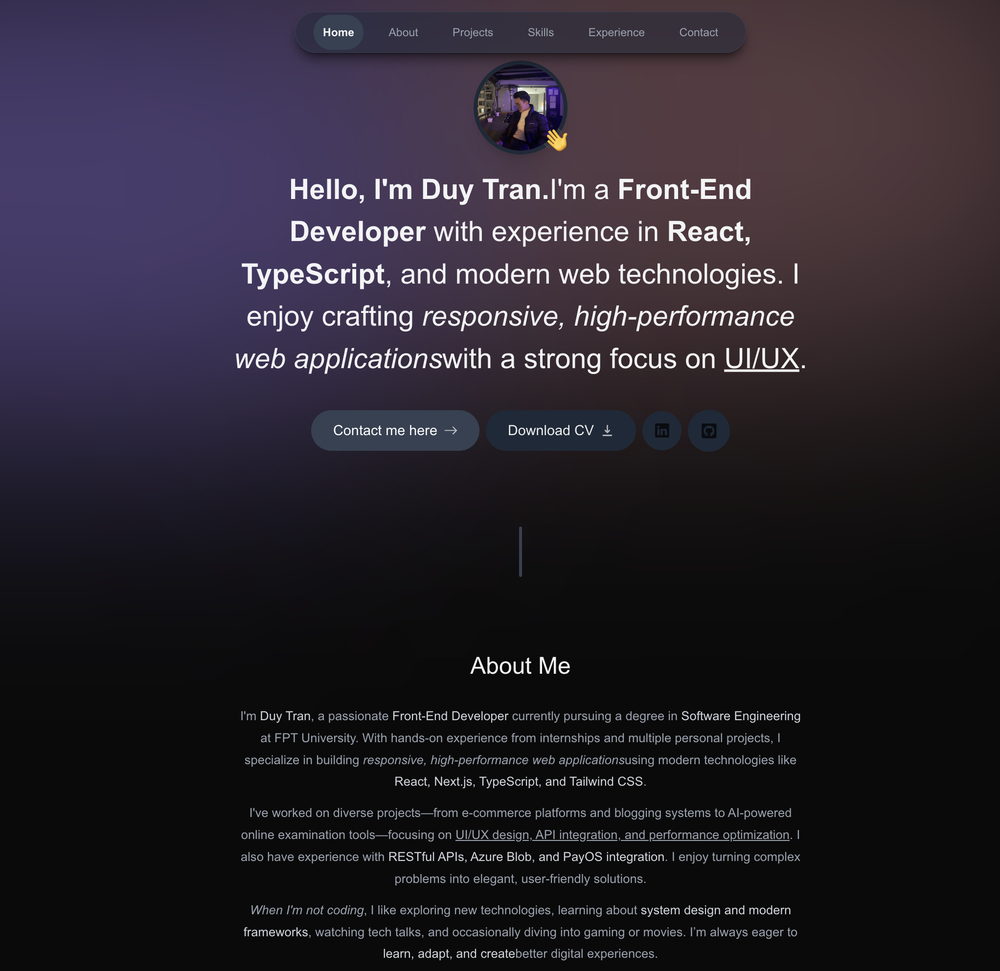

# Personal Portfolio Website

A modern, responsive personal portfolio built with **Next.js**, **TypeScript**, **Tailwind CSS**, and **Framer Motion**.  
This website showcases my projects, technical skills, and background as a frontend developer — optimized for performance, accessibility, and smooth user experience.

---

## 👨‍💻 About Me

I’m **Trần Minh Duy**, a frontend developer passionate about building user-centric, high-performance web applications.  
My focus is on **clean UI/UX**, **API integration**, and **performance optimization**, ensuring every product I deliver is both visually appealing and technically robust.

- 🎓 **Education:** Software Engineering, FPT University (GPA: 7.5/10)
- 💼 **Experience:** Frontend Developer at Next Level Solution
- 🏆 **Awards:** Multiple "Good Student" semester awards
- 🌍 **Location:** Hà Nội, Việt Nam

---

## 🚀 Features

- **Responsive Design** — Fully optimized for desktop, tablet, and mobile.
- **Fast Performance** — Built with Next.js static site generation and image optimization.
- **Smooth Animations** — Micro-interactions and transitions powered by Framer Motion.
- **SEO Friendly** — Structured meta tags and semantic HTML for better visibility.
- **Dynamic Projects Section** — Projects fetched and displayed dynamically with GitHub links.
- **Dark/Light Mode** — User-friendly theme switcher for better accessibility.

---

## 🛠 Tech Stack

- **Frontend:** Next.js, TypeScript, Tailwind CSS, Framer Motion
- **Version Control:** Git, GitHub
- **Deployment:** Vercel

---

## 📂 Projects Overview

### 1. **AI Kiosk Testing System (AKTS)**

- AI-powered online examination platform with real-time emotion recognition.
- Tech Stack: React.js, TypeScript, Tailwind CSS, Formik

### 2. **Second-Hand E-commerce Platform**

- Responsive web app for buying and selling second-hand products.
- Integrated PayOS and Azure Blob Storage.
- Tech Stack: React, TypeScript, RESTful APIs

### 3. **GreenHappy – Eco-friendly E-commerce**

- Platform for plantable greeting cards promoting sustainability.
- Tech Stack: React, TypeScript, Tailwind CSS

### 4. **Blog Platform**

- MERN stack blog with Cloudinary integration and SEO optimization.

---

## 📦 Installation & Development

```bash
# Clone repository
git clone https://github.com/yourusername/portfolio.git

# Install dependencies
npm install

# Start development server
npm run dev

<h2>Demo Project</h2>

```
